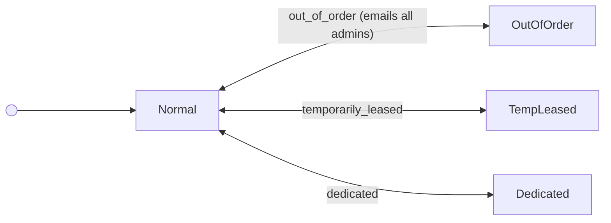
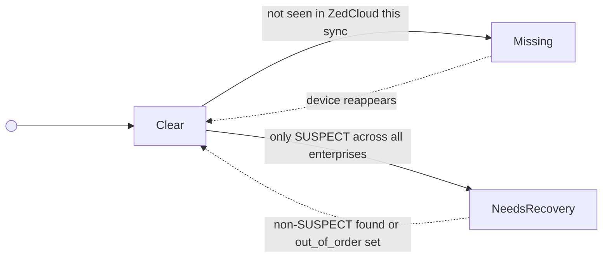
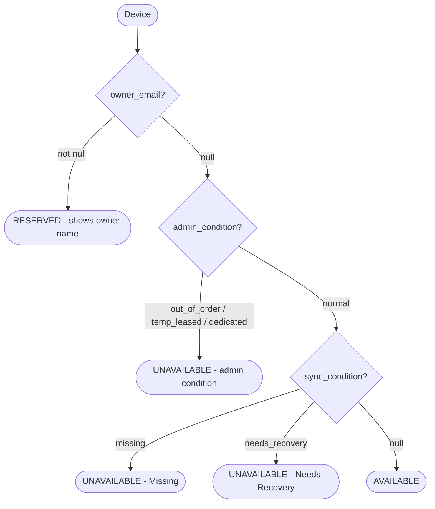
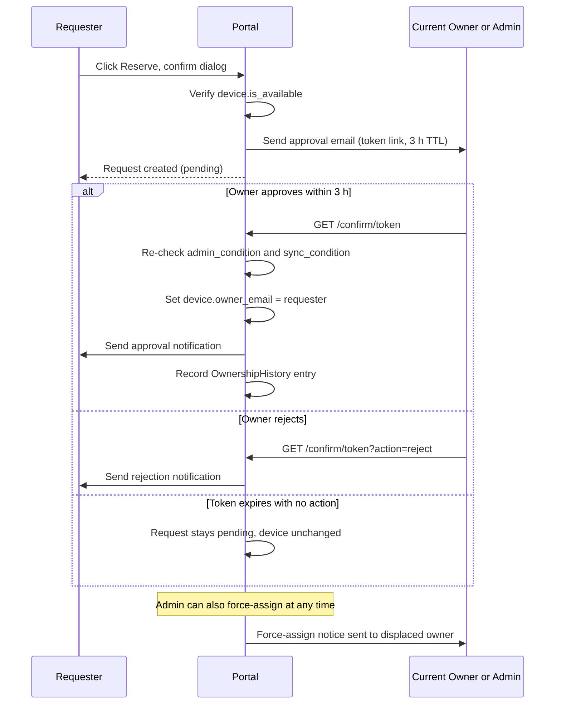
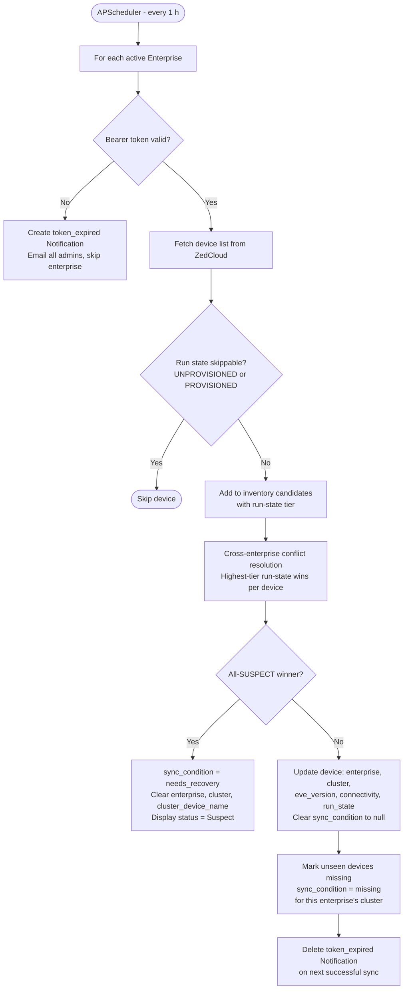

# Holocron — Feature Set

**Holocron** is an internal device-management portal for tracking bare-metal and edge hardware across labs, managing device reservations, and staying in sync with the ZedCloud inventory.

---

## Table of Contents

1. [Authentication](#1-authentication)
2. [Device Inventory](#2-device-inventory)
3. [Device Status Model](#3-device-status-model)
4. [Reservation Workflow](#4-reservation-workflow)
5. [Enterprise & Cluster Sync](#5-enterprise--cluster-sync)
6. [Untracked Devices](#6-untracked-devices)
7. [User Management](#7-user-management)
8. [Notifications](#8-notifications)
9. [Bulk Import / Export](#9-bulk-import--export)
10. [Background Jobs & Email](#10-background-jobs--email)
11. [REST API Summary](#11-rest-api-summary)

---

## 1. Authentication

Login is identity-picker based — no passwords. Users select their account from a pre-registered list; the selection is stored in `localStorage` and sent as `X-User-Email` on every API request. There is no session cookie or token-refresh flow.

**Roles:**
| Role | Capabilities |
|---|---|
| `admin` | Full CRUD on all resources, force-assign, import/export, cluster/enterprise management |
| `member` | Reserve/release own devices, update purpose, read-only on everything else |

---

## 2. Device Inventory

The main view lists all tracked devices with real-time ZedCloud run-state, lab assignment, owner, and purpose. Filters and search are persisted in `sessionStorage` across page refreshes.


### Filters & Search

- **Full-text search** — name, model, cluster, owner email, EVE version, purpose text
- **Availability toggle** — All / Available / Reserved
- **Admin Condition** — Normal, Out of Order, Temporarily Leased, Dedicated
- **Sync Status** — Any / Missing / Needs Recovery
- **Lab** — per-lab dropdown (DB-backed, no hardcoding)
- **Team** — per-team dropdown (DB-backed)

**Summary bar** (above table): counts for `Total`, `Available`, `Online` across the *currently filtered* set; problem-state counts appear only when non-zero.

### Expanded Row

Clicking the expand toggle reveals the full device detail inline: IDRAC IP/username, EVE version, connected interfaces, cluster name, purpose history, and ownership history.


### Per-row Actions

| Action | Available when | Who |
|---|---|---|
| **Reserve** | `is_available = true` | Any portal user |
| **Release** | Device has an owner | Owner or admin |
| **Force Assign** | Any device | Admin only |
| **Set Purpose** | Any device | Any portal user |
| **Edit** | Any device | Admin only |
| **Refresh Status** | Any device | Any portal user |
| **Delete** | Any device (no linked reservations) | Admin only |

---

## 3. Device Status Model

A device's availability is determined by **two independent condition fields** — one user-controlled, one sync-engine-controlled.

```
is_available = (owner_email IS NULL)
             AND (admin_condition = 'normal')
             AND (sync_condition IS NULL)
```

### admin_condition (user-controlled)



> Bidirectional arrows: admin sets the condition (Normal → state) or restores it (state → Normal).

### sync_condition (sync-engine-controlled — never writable via API)



> Solid arrows: sync engine sets the condition. Dotted arrows: sync engine clears it back to null.

> **Rule:** When `admin_condition = 'out_of_order'`, the sync engine never sets `sync_condition`; any stale value is cleared instead. Out-of-order always supersedes sync findings.

### Combined Availability Flow



---

## 4. Reservation Workflow

Any portal user can request a device. The current owner (or any admin) receives an email with a time-limited approval link.




**Release flow:** Owner or admin sets `owner_email = null`; an `OwnershipHistory` row is written with the reason. Any pending reservation for the device is cancelled.

---

## 5. Enterprise & Cluster Sync

ZedCloud inventory is pulled once per hour via a background scheduler. Each **Enterprise** belongs to one **Cluster**; an enterprise's bearer token is stored Fernet-encrypted.




**Adding an enterprise** — UI accepts only a bearer token; the enterprise name is fetched automatically from ZedCloud `/v1/enterprises/self`. Creation is blocked if ZedCloud reports a non-`ACTIVE` state.

**Token rotation** — updating a bearer token triggers a background re-verification; if the new token fails, a fresh `token_expired` notification is created.

---

## 6. Untracked Devices

Devices discovered in ZedCloud that have no matching portal inventory record are surfaced here. Admins can promote them into the inventory with a single click.


Each untracked device shows its ZedCloud name, serial number, cluster, first-seen timestamp, and current run state. Moving to inventory opens a pre-filled edit form so metadata (lab, team, IDRAC) can be added before saving.

---

## 7. User Management

Admins manage the list of portal users (name, email, team, role). Users are not Django auth users — they are `PortalUser` records identified by email.


- **Roles:** `admin` or `member`
- **Teams:** DB-backed (EVE, PLATFORM, ST — extensible via Django admin)
- **Bulk operations:** CSV/JSON export and import with validation
- Deleting a user who owns devices reassigns ownership to `null` automatically

---

## 8. Notifications (Admin Only)

The notification bell in the header shows unread alerts for admins. Each notification links to the relevant resource.


| Kind | Trigger | Action on click |
|---|---|---|
| `token_expired` | Enterprise bearer token rejected by ZedCloud | Navigate to Clusters page |
| `sync_error` | Unexpected sync failure for an enterprise | Navigate to Clusters page |
| `name_mismatch` | ZedCloud enterprise name differs from stored name | Inline "Use ZedCloud name" / "Keep current name" buttons |
| `enterprise_inactive` | ZedCloud reports enterprise state ≠ ACTIVE | Navigate to Clusters page |

`token_expired` notifications are **automatically deleted** when the next sync for that enterprise succeeds.

---

## 9. Bulk Import / Export


### Device Import (CSV / JSON)

- **Modes:** `create_only` (default) or `update` (upsert by serial number)
- **Limit:** 200 devices per import
- Auto-creates missing DeviceModel, Cluster, Lab, Team records
- Validates emails, IP addresses, and enum values; returns per-row error report
- `admin_condition` is normalised on import; `sync_condition` is never read from CSV

### Device Export

- Formats: CSV or JSON (`?fmt=csv` / `?fmt=json`)
- 24 columns including IDRAC credentials (plaintext username, encrypted password not exported)

### Other Import/Export Endpoints

| Resource | Export | Import |
|---|---|---|
| Devices | `GET /api/v1/admin/export/` | `POST /api/v1/admin/import/` |
| Users | `GET /api/v1/users/export/` | `POST /api/v1/users/import/` |
| Clusters | `GET /api/v1/clusters/export/` | `POST /api/v1/clusters/import/` |

---

## 10. Background Jobs & Email

### Scheduled Jobs (APScheduler — UTC)

| Job | Schedule | What it does |
|---|---|---|
| `sync_all_enterprises` | Every 1 hour | Full ZedCloud sync for all active enterprises; marks missing/needs-recovery; fires token alerts |
| `send_nightly_digest` | 00:00 UTC daily | Emails all admins a summary: device counts, unavailable list, pending reservations |

### Email Triggers

| Event | Recipient(s) |
|---|---|
| Reservation request created | Device owner (approval link) |
| Reservation approved | Requester |
| Reservation rejected | Requester |
| Reservation overridden by admin | Requester (cancellation notice) |
| Force-assign displaces owner | Displaced owner |
| `admin_condition` → `out_of_order` | All admins |
| Bearer token expired | All admins |
| Nightly digest | All admins |

All emails are no-ops when `EMAIL_HOST` is blank (local dev default).

---

## 11. REST API Summary

Base path: `/api/v1/`

| Resource | Endpoints | Notes |
|---|---|---|
| `devices/` | GET, POST, PATCH, DELETE | Filterable by lab/team/condition/sync/owner/status |
| `devices/<id>/reserve/` | POST | Initiates reservation request |
| `devices/<id>/release/` | POST | Releases owner |
| `devices/<id>/force-assign/` | POST | Admin only |
| `devices/<id>/status/` | POST | Fetches live run-state from ZedCloud (pass `enterprise_id`) |
| `devices/<id>/purpose/` | POST | Sets/clears device purpose text |
| `devices/<id>/ownership-history/` | GET | Audit log |
| `untracked-devices/` | GET | ZedCloud devices not in inventory |
| `untracked-devices/<id>/move-to-inventory/` | POST | Admin only |
| `clusters/` | GET, POST, PATCH, DELETE | Includes import/export |
| `enterprises/<id>/` | GET, PUT | PATCH bearer token |
| `enterprises/<id>/sync/` | POST | Manual sync trigger |
| `reservations/pending/` | GET | Admin: all pending requests |
| `reservations/mine/` | GET | Current user's reservations |
| `reservations/<id>/approve/` | POST | Admin or device owner |
| `reservations/<id>/reject/` | POST | Admin or device owner |
| `users/` | GET, POST, PATCH, DELETE | Includes import/export |
| `notifications/` | GET | Admin only; supports mark-read |
| `choices/` | GET | Labs, teams, conditions — cached `staleTime: Infinity` |
| `admin/export/` | GET | Full device CSV/JSON dump |
| `admin/import/` | POST | Bulk device import |
| `admin/latency/` | GET | Request latency metrics (admin only) |
| `version/` | GET | App version string |
| `config/` | GET | Client config (poll intervals) |

Token-based reservation confirmation endpoints (`/confirm/<token>`) require **no authentication** — they are public.
